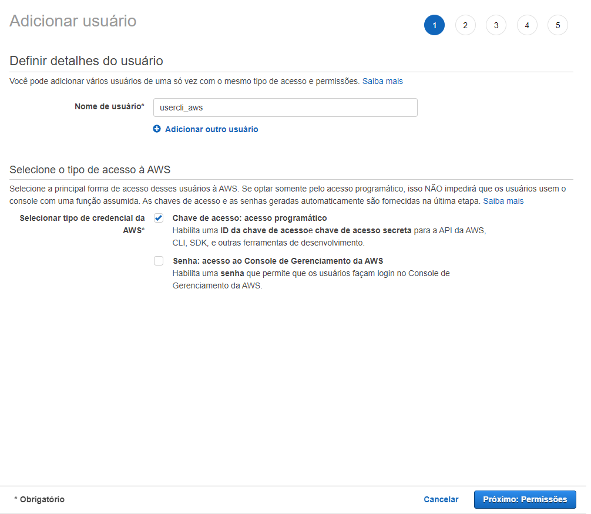
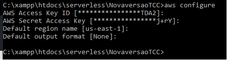

# AWS CLI


## Pré-requisitos

- Uma versão de 64 bits do Windows XP ou posterior.
- Direitos de administrador para instalar o software 

## Instalação do AWS CLI no Windows

As etapas a seguir permitem que você instale a versão 2 do AWS CLI no Windows.

1. Fazer download e executar o instalador MSI da AWS CLI para Windows (64 bits)
    - Obter a versão mais recente do AWS CLI: (https://awscli.amazonaws.com/AWSCLIV2.msi)

Como alternativa, você pode executar o comando msiexec para executar o instalador MSI.
```
C:\> msiexec.exe /i https://awscli.amazonaws.com/AWSCLIV2.msi

```
2. Para confirmar a instalação, abra o menu Início, procure cmd para abrir uma janela do prompt de comando e, no prompt de comando, use o comando ``` aws --version ```.

```
C:\> aws --version
aws-cli/1.19.110 Python/3.6.0 Windows/10 botocore/1.20.110
```

## Criar um usuário no IAM(Identity and Access Management) no console AWS.

No painel de navegação, escolha *Usuários* e depois *Adicionar usuário*.

Siga os seguintes passos abaixo:

1. Criar nome do seu usuário e selecionar a caixa *Acesso Programático.*


2. Criar um grupo e adicionar o usuário criado no grupo e atribuir políticas de acesso.


Digite o nome do seu grupo e selecione a permissão *AdministratorAccess* para ter acessos aos recursos e serviços através da AWS-CLI. 




