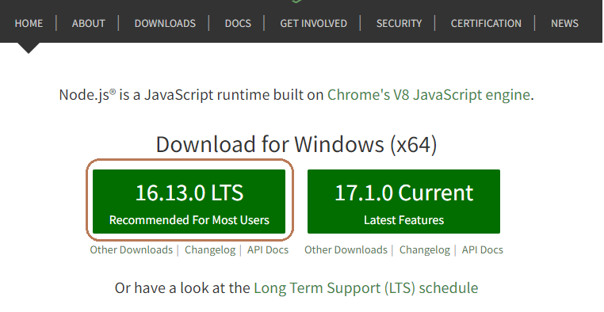
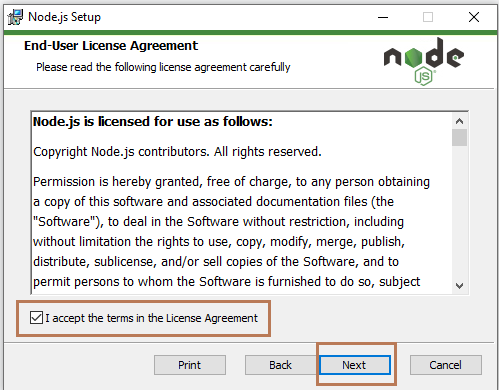
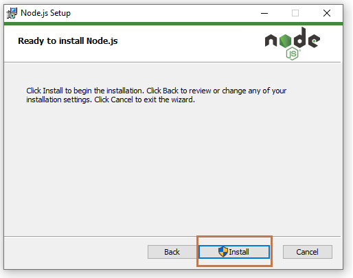

# NodeJS


## Instalação

As etapas a seguir permitem que você instale o Nodejs e o framework *Serverless* no windows.

1. Fazer o download e executar o instalador MSI no Windows.<br>


2. Aceitar os termos de uso do Nodejs.<br>


3. Pasta de destino e armazenamento do programa.<br>


4. customização de instalação.<br>


5. Finalização da instalação.<br>


6. Instalando framework *Serverless* pela linha de comando utilizando o gerenciador de pacotes do nodejs o **npm**<br>
No prompt de comando, execute o comando a seguir: 

```npm install serverless -g
```

7. Instalando kit de desenvolvimento SDK para nodejs, para utilização dos serviços AWS.<br>
No prompt de comando, execute o comando a seguir:
```
npm install aws-sdk --save-dev

```
