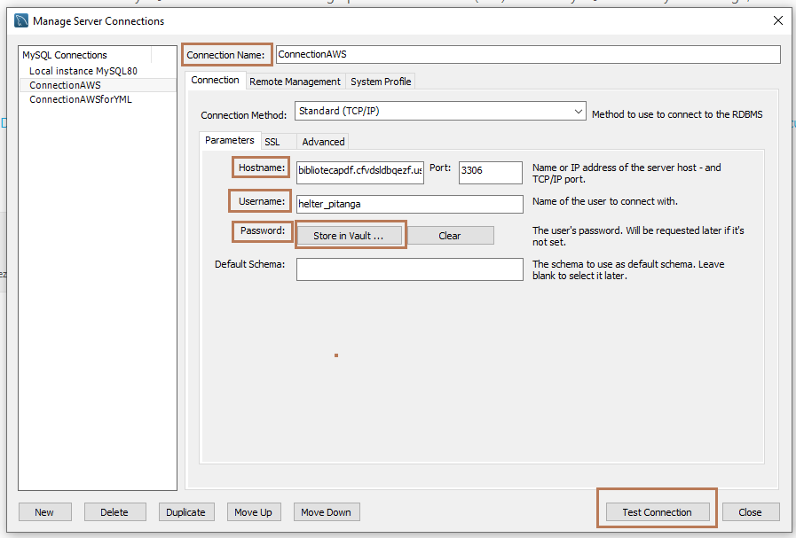
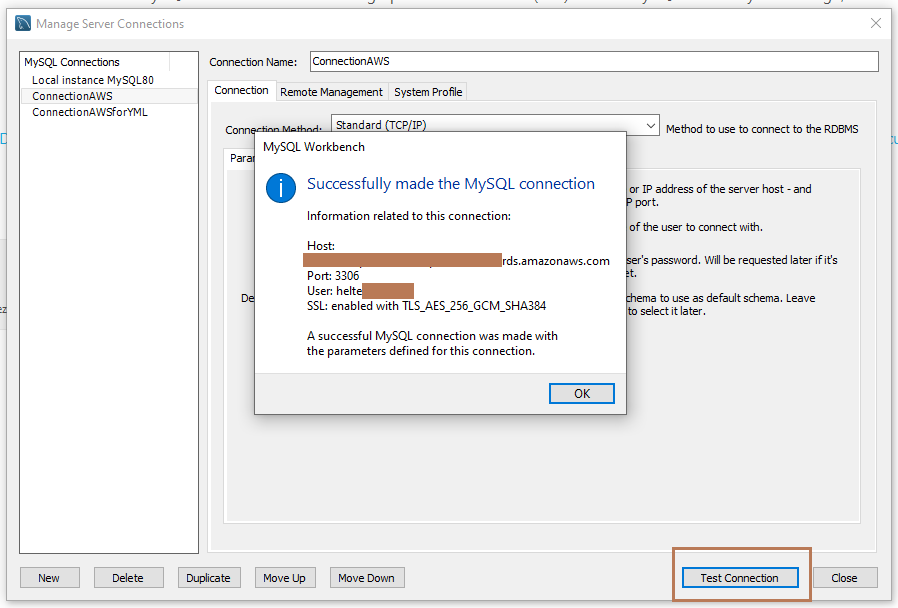
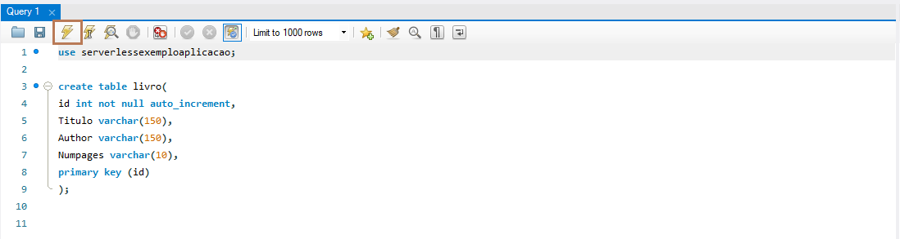
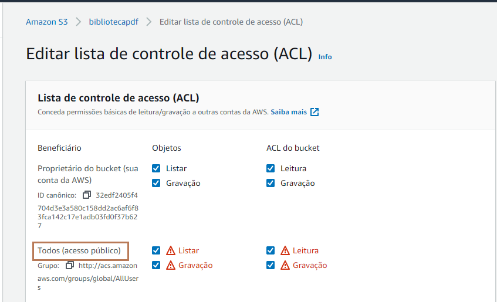
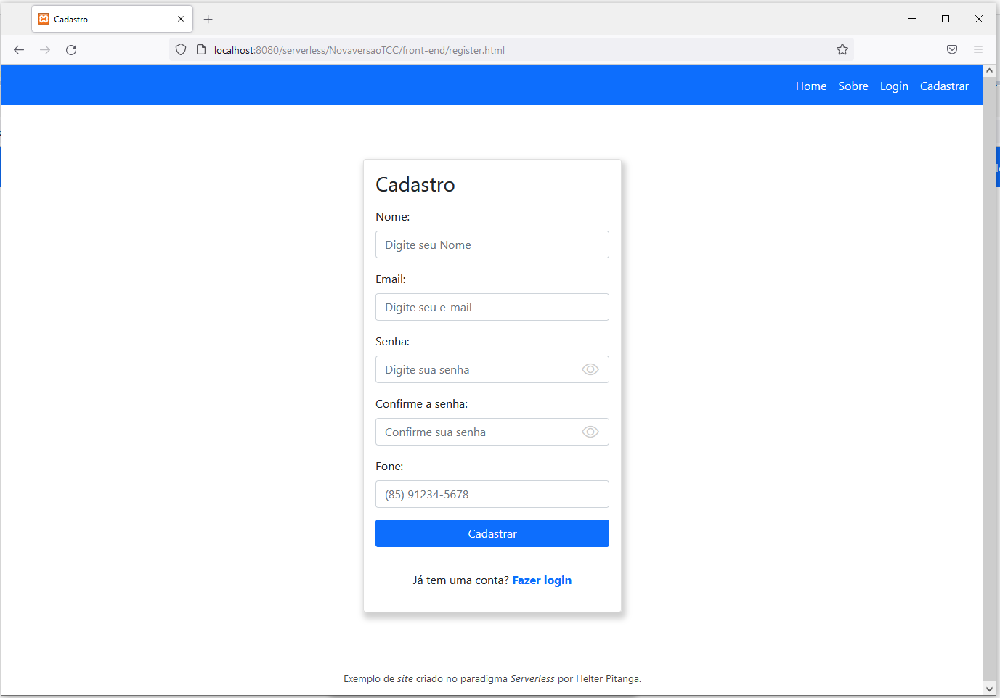
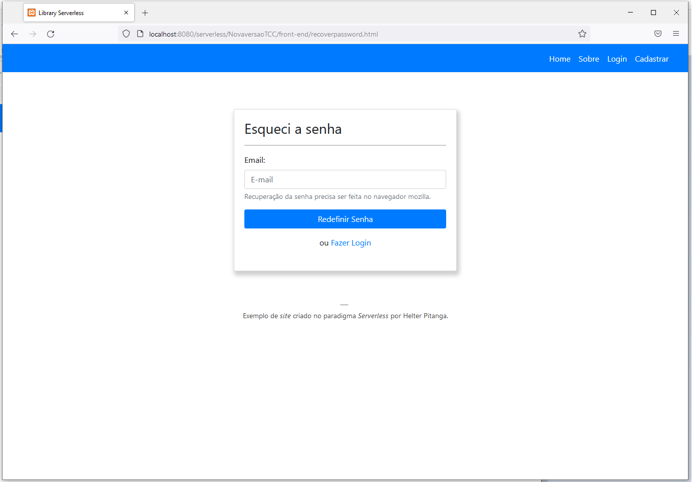
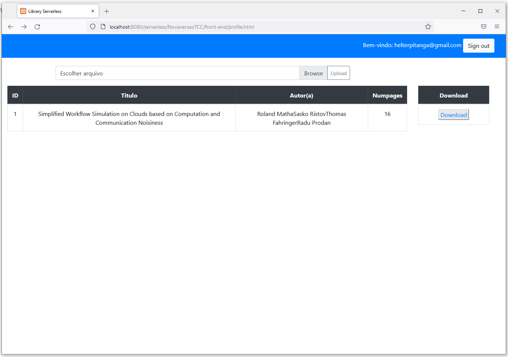

# Repositório de arquivos PDFs Serverless com AWS
Este é um aplicativo que demonstra como utilizar as tecnologias da AWS para construir uma aplicação de **repositório de arquivos PDFS sem servidor**.
O aplicativo mostra como criar um projeto sem servidor com Amazon cognito, Amazon SNS, Amazon Lambda, Amazon RDS e Amazon S3.

## :card_index: Tabela de conteúdos

* [Recursos](#recursos)
* [Apresentação serviços AWS](#apresentação-serviços-aws)
* [Arquitetura](#arquitetura)
* [Instalação](#instalação)
* [Visão Geral da aplicação](#visão-geral-da-aplicação)

## :rocket: Recursos
- Registrar usuário
- Login / Logout
- Envio SMS para o usuário
- Upload de arquivo bucket S3
- Envio de dados do S3 para o RDS
- Download de arquivo do bucket

## :sparkles: Apresentação serviços AWS

- Funções sem servidor com [AWS Lambda](https://aws.amazon.com/pt/lambda/)
- Acesso e controle das API com [AWS API Gateway](https://aws.amazon.com/pt/api-gateway/)
- Autenticação com [Amazon Cognito](https://aws.amazon.com/pt/cognito/) e grupo de usuários [Pool usuários Cognito](https://docs.aws.amazon.com/cognito/latest/developerguide/cognito-user-identity-pools.html)
- Envio de SMS com [Amazon SNS](https://aws.amazon.com/pt/sns/)
- Armazenamento de arquivos com [Amazon S3](https://aws.amazon.com/pt/s3/)
- Armazenamento de metadados com [Amazon RDS](https://aws.amazon.com/pt/rds/)

## :bookmark_tabs: Arquitetura


## :computer: Instalação

**Pré-requisitos:**

- Instalação e configuração da [AWS Command Line Interface](https://github.com/HelterL/Reposit-rio-de-arquivos-Serverless-AWS/tree/master/AWS%20CLI)
- Instalação da linguagem NodeJS e do framework *Serverless* [Nodejs&Serverless](https://github.com/HelterL/Reposit-rio-de-arquivos-Serverless-AWS/tree/master/Nodejs/README.md)
- Instalação do banco de dados Mysql Workbench [Mysql Workbench](https://dev.mysql.com/downloads/workbench/)

1. Clone o repositório do github.

```
git clone https://github.com/HelterL/Reposit-rio-de-arquivos-Serverless-AWS.git

```

2. Execute o comando abaixo e digite os dados que se perdem, para o nome do bucket, nome do banco de dados, usuário e senha para o banco de dados.
```
node script.js

```

Exemplo de preenchimento, utilize apenas letras minúsculas e/ou números.

```

Qual o nome do bucket?
exemplobucketname
Qual nome do banco de dados?
serverlessexemploaplicacao
Qual o nome do usuário para o banco de dados?
teste321
Qual a senha para o banco de dados?
1234teste321

```

3. Dentro do arquivo **gerador-arquivoupload.js**, na linha abaixo altere para o nome que foi dado ao bucket na execução do script.

```
 const bucketName = 'Nome do seu bucket';

```

4. Depois execute o seguinte comando abaixo.

```

node gerador-arquivoupload.js

```

5. Deploy da aplicação com o framework *serverless*, execute o comando abaixo.

```
serverless deploy

```

- **Obs** Deve demorar mais ou menos entre 15 a 20 minutos, pois a criação do banco de dados é bem demorada. Então é o tempo de ir tomar café😍

6. Após a finalização do deploy, entre na pasta **back-end/apis.js**, e coloque as informações do nome do bucket e das APIS.
Os endpoints das APIs se encontram no prompt de comando, na finalização do deploy, cole-os para o arquivo e salve.

```
    var BUCKET_NAME =  "Nome do bucket";
    var API_MYSQL = "cole a api api_mysql";
    var API_LIST = "cole a api_list";

``` 

Dentro do arquivo **back-end/register_sms.js** adicione o endpoint da API SMS dentro do arquivo na seguinte variável e salve:

```
 var API_SMS = "cole a API SMS";

```
7. Dentro do arquivo **back-end/configcognito.js**, adicione o **UserPoolId** e o **ClientId** que foram gerados após o deploy da aplicação.<br>
Essas informações podem ser encontradas no arquivo **outputs.toml** nas linhas 2 e 5, mas cuidado para não se confundir e após isso salve, Exemplo :

```

window._config = {
    cognito: {
        userPoolId: "us-east-1_AlJsadjASHF", // UserPoolId
        region: 'us-east-1', // Região
		clientId: "39c2ajfohe29b7q12s79057/ASsc9"
    },
};

```

8. Configuração do banco de dados, entre no aplicativo do mysql Worbench e coloque os seguintes dados para acessar o banco de dados.<br>
Dê um nome para a conexão, dentro do campo **Connection Name**, dentro do arquivo **outputs.toml** encontre a seguinte linha com a variável **EndpointAddressDBRDS** e cole o resultado dentro da opção **Host** do Mysql Workbench. 
Coloque o nome do usuário que foi dado na execução do script, e clique na opção *Store in Vault* para adicionar a senha que foi dado no inicio, segue exemplo.



Após isso, clique em **Teste connection** para verificar se a conexão com o banco de dados foi um sucesso, caso contrário verifique se as informações foram adicionadas de forma corretas.



9. Após a conexão ser um sucesso, clique em **close** e duplo clique na caixa que foi criada com o nome da conexão que foi criada. Dentro do banco de dados execute os comandos a seguir, altere o **nome-do-banco-de-dados** para o nome do banco que foi dado no inicio;

```

use nome-do-banco-de-dados;

create table livro(
id int not null auto_increment,
Titulo varchar(150),
Author varchar(150),
Numpages varchar(10),
primary key (id)
);

```

Após isso clique no raio na parte superior, segue exemplo.


10. Entre na dashboard da AWS e vá no serviço S3, entre no bucket com o nome que foi dado e entre na opção **Permissões** role a página para baixo e encontre a seguinte opção **Lista de controle de acesso (ACL)** clique em editar acione as opções Listar e Gravação para todos os usuários.
Lembrando, isso não é recomendado mas aqui é apenas para uso de demonstração. Segue exemplo.


11. Após isso, entre no arquivo **front-end/index.html** e aproveite!

12. Finalização da stack e remoção de todos os recursos criados. Execute o seguinte comando.<br>

```
serverless remove

```

## :mag_right: Visão geral da aplicação

1. Página de cadastro ``` register.html ```<br>
Cadastre um usuário usando o pool de usuários do Amazon Cognito.


2. Página de Login ``` login.html ```<br>
Faça login utilizando o pool de usuários do Amazon Cognito. 


3. Página de recuperação de senha ```recoverpassword.html ``` <br>


4. Página principal ``` profile.html ``` <br>
Faça upload de artigos PDFs para o bucket S3 e armazene os metadados no banco de dados RDS e faça o download dos arquivos posteriormente


## Melhorias futuras
