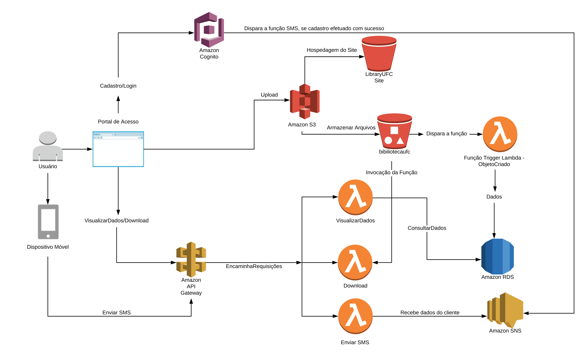

# Repositório de arquivos PDFs Serverless com AWS
Este é um aplicativo que demonstra como utilizar as tecnologias da AWS para construir uma aplicação de **repositório de arquivos PDFS sem servidor**.
O aplicativo mostra como criar um projeto sem servidor com Amazon cognito, Amazon Lambda, Amazon RDS e Amazon S3.

## Tabela de conteúdos

* [Recursos](#recursos)
* [Apresentação serviços AWS](#apresentação-serviços-aws)
* [Arquitetura](#arquitetura)
* [Instalação](#instalação)

## Recursos
- Registrar usuário
- Login / Logout
- Envio SMS para o usuário
- Upload de arquivo bucket S3
- Envio de dados do S3 para o RDS
- Download de arquivo do bucket

## Apresentação serviços AWS

- Funções sem servidor com [AWS Lambda](https://aws.amazon.com/pt/lambda/)
- Acesso e controle das API com [AWS API Gateway](https://aws.amazon.com/pt/api-gateway/)
- Autenticação com [Amazon Cognito](https://aws.amazon.com/pt/cognito/) e grupo de usuários [Pool usuários Cognito](https://docs.aws.amazon.com/cognito/latest/developerguide/cognito-user-identity-pools.html)
- Envio de SMS com [Amazon SNS](https://aws.amazon.com/pt/sns/)
- Armazenamento de arquivos com [Amazon S3](https://aws.amazon.com/pt/s3/)
- Armazenamento de metadados com [Amazon RDS](https://aws.amazon.com/pt/rds/)

## Arquitetura

## Instalação

**Pré-requisitos:**

1. Instalação e configuração da [AWS Command Line Interface](https://github.com/HelterL/Reposit-rio-de-arquivos-Serverless-AWS/tree/master/AWS%20CLI)
2. Instalação da linguagem NodeJS e do framework *Serverless* [Nodejs&Serverless](https://github.com/HelterL/Reposit-rio-de-arquivos-Serverless-AWS/tree/master/Nodejs/README.md)

